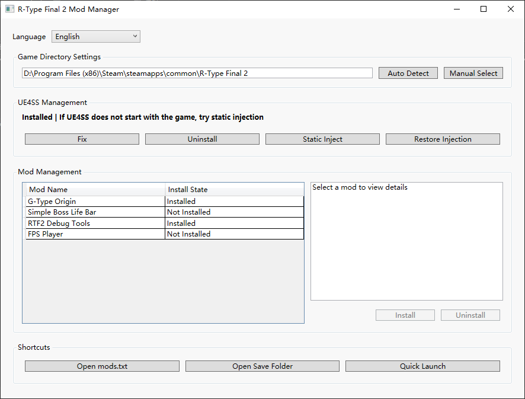

[简体中文](Readme/README.zhs.md) | [日本語](Readme/README.ja.md)

# R-Type Final 2 Mod Manager

This program aims to simplify the *UE4SS* dependency installation, Mod file deployment, management, and uninstallation processes for *R-Type Final 2*, providing players with a ready-to-use Mod experience.

## User Guide

### Installation and Launch

1. Download `RTF2ModManager.zip` from [Releases](https://github.com/BLACKujira/GTypeOrigin/releases)
2. Extract the contents of the compressed file to any directory (Please **do not** double-click the program inside the zip file, as this may cause the program to fail to locate Mod files)
3. Run `RTF2ModManager.exe`
4. If you are using *Steam* and have not modified the default installation path, the program will automatically locate the game directory; otherwise:
    - Click `Game Directory Settings` → `Manual Select`
    - Select the game installation directory in the pop-up window

### UE4SS Management

1. If *UE4SS* is not installed or you encounter issues:
    - Click `Install`or `Fix`
- **Note**: After the initial *UE4SS* installation, please **launch the game once** to generate the necessary files and folders.
1. If *UE4SS* fails to launch with the game (known to occur for some Windows 7 users), please try `Static Inject`

### Mod Management

1. Select the Mod you want to manage from the list on the left.
2. View the Mod information on the right.
3. Click to install or uninstall.

### Quick Functions

The bottom of the program provides three quick function buttons:

| Button | Function Description |
|---|---|
| Open mods.txt | Opens the LUA Mod registry. The program automatically maintains this file, so manual modification is usually not required. |
| Open Save Folder | Opens the game save folder. **It is recommended to back up all files in this folder before installing Mods.** |
| Quick Launch | Quickly launches the game, bypassing Steam, which is convenient for debugging. However, this method cannot access any DLC stages. |

## Included Mods

| Mod | Introduction |
|---|---|
| [G-Type Origin](https://github.com/BLACKujira/GTypeOrigin) | Adds 3 Gradius-style homage stages. |
| [Simple Boss LifeBar](https://github.com/BLACKujira/GTypeOrigin) | Adds a simple health bar for Boss battles; does not apply to Boss Rush. |
| [RTF2 Debug Tools](https://github.Hujira/GTypeOrigin) | Cheating tools for debugging stages. Please **do not** use for unfair competition. |
| [FPS Player](https://github.com/BLACKujira/GTypeOrigin) | Changes the gameplay to first-person shooter. Requires activation using the UE4SS Mod button. |

For detailed information and usage instructions for each Mod, please refer to their respective homepages.

## Notes

1. This program lacked sufficient testing after development and may contain some bugs. Its performance in different system environments has not yet been clearly determined.
2. Due to the small number of current R-Type Final 2 Mods, the Mod information is hard-coded into the program, making it less convenient for expansion. The Mods themselves are also placed within the program directory, and there is no online update function yet.
3. Although the program itself is not complex, the compressed file is large due to the inclusion of the *.NET 8.0 Runtime*, *UE4SS zDEV-UE4SS_v3.0.1*, and the *G-Type Origin Mod*. Please be patient during the download.