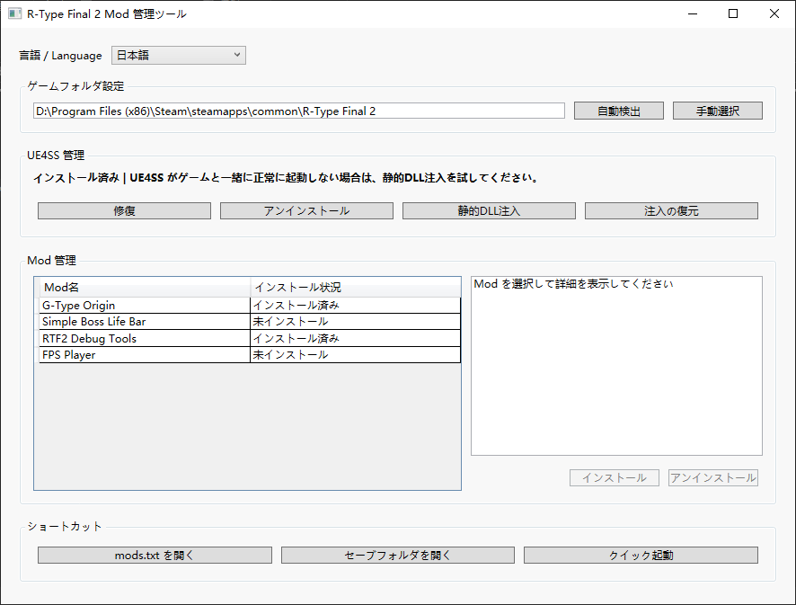

# R-Type Final 2 Mod Manager

このプログラムは、R-Type Final 2 の **UE4SS** 依存関係のインストール、Mod ファイルの展開、管理、およびアンインストールプロセスを簡素化し、プレイヤーに**すぐに使える Mod 体験**を提供することを目的としています。

## 使用ガイド

### インストールと起動

1.  [Releases](https://github.com/BLACKujira/GTypeOrigin/releases) から `RTF2ModManager.zip` をダウンロードします。
2.  圧縮ファイルの内容を**任意のディレクトリに解凍**します（圧縮ファイル内から直接プログラムを実行しないでください。Mod ファイルを見つけられずにエラーが発生する可能性があります）。
3.  `RTF2ModManager.exe` を実行します。
4.  *Steam* を使用しており、デフォルトのインストールパスを変更していない場合、プログラムは自動的にゲームディレクトリを特定します。そうでない場合は、以下の手順で手動で設定します。
    * `ゲームディレクトリ設定` → `手動選択` をクリックします。
    * 表示されたウィンドウで**ゲームのインストールディレクトリ**を選択します。

### UE4SS 管理

1.  *UE4SS* がインストールされていない場合、または問題が見つかった場合:
    * `インストール` または `修復` をクリックします。
    * **注意**：*UE4SS* を**初回インストール**した後、**一度ゲームを起動**して必要なファイルとフォルダーを生成してください。
2.  *UE4SS* がゲームと一緒に起動できない場合（一部の Windows 7 ユーザーで報告されている）、`静的インジェクション` を試してください。

### Mod 管理

1.  左側のリストから操作したい Mod を選択します。
2.  右側で Mod の情報を確認します。
3.  インストールまたはアンインストールをクリックします。

### ショートカット機能

プログラムの下部には、3つのショートカット機能ボタンが用意されています。

| ボタン | 機能説明 |
| :--- | :--- |
| `mods.txt を開く` | LUA Mod レジストリを開きます。プログラムが自動的にこのファイルを維持するため、通常、手動で変更する必要はありません。 |
| `セーブフォルダを開く` | ゲームのセーブデータフォルダを開きます。**Mod をインストールする前に、このフォルダ内のすべてのファイルをバックアップすることを推奨します**。 |
| `クイック起動` | Steam をバイパスしてゲームを高速起動します。デバッグに便利ですが、この方法では**いかなる DLC ステージにもアクセスできません**。 |

## 含まれている Mod

| Mod | 概要 |
| :--- | :--- |
| [G-Type Origin](https://github.com/BLACKujira/GTypeOrigin) | Gradius スタイルのオマージュステージを 3つ追加します。 |
| [Simple Boss LifeBar](https://github.com/BLACKujira/GTypeOrigin) | ボス戦に簡易的なライフバーを追加します（BossRush には適用されません）。 |
| [RTF2 Debug Tools](https://github.com/BLACKujira/GTypeOrigin) | ステージデバッグ用のチートツールです。不正な競争目的での使用はご遠慮ください。 |
| [FPS Player](https://github.com/BLACKujira/GTypeOrigin) | ゲームプレイを一人称シューティングに変更します。UE4SS の Mod ボタンを使用して有効化する必要があります。 |

Mod の詳細情報、使用方法については、それぞれのホームページを参照してください。

## 注意事項

1.  このプログラムは開発完了後に十分なテストが行われておらず、いくつかのバグが存在する可能性があります。また、異なるシステム環境下での動作はまだ明確になっていません。
2.  現在、R-Type Final 2 の Mod は少ないため、Mod に関する情報はコード内にハードコーディングされており、拡張は容易ではありません。Mod 自体もプログラムディレクトリ内に配置されており、オンライン更新機能はまだありません。
3.  プログラム自体は複雑ではありませんが、*.NET 8.0 Runtime*、*UE4SS zDEV-UE4SS\_v3.0.1*、および *G-Type Origin Mod* が含まれているため、圧縮ファイルの**サイズが大きく**なっています。ダウンロードにはしばらくお待ちください。